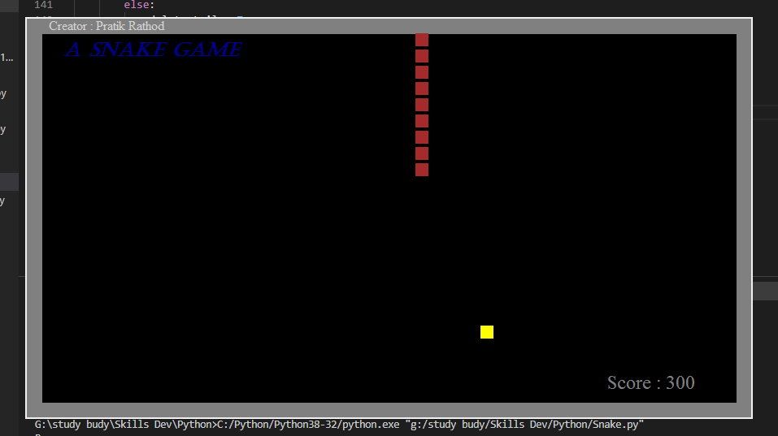

## Shake 🐍 game using python tkinter

 - There are many hidden control into it just download code explore it 
 - Use arrow keys to change direction of snake 
 - I will integrate ML model soon ~~maybe~~
 - download code & run it on your local machine 
 - it took me  1 day to learn tkinter & make this game 
 
**Screenshot**
>
